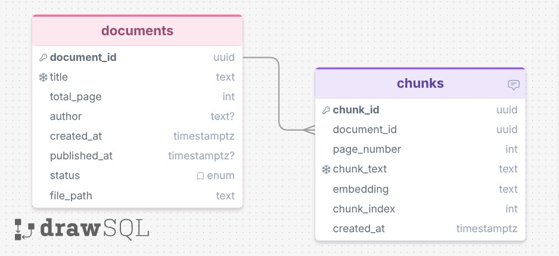

# Culinary Technique RAG System

A backend-focused culinary intelligence system that combines **LLM-based intent normalization**, **retrieval-augmented generation (RAG)**, and **decision-based technique planning** to answer cooking questions and generate grounded cooking strategy.

This project is designed primarily as a **backend architecture showcase**.  
Its core value is in the API design, retrieval pipeline, structured reasoning flow, and modular system design.  
Any frontend included in the project is intentionally lightweight and serves only as a simple interface for demonstrating the backend system in action.

This project goes beyond simple recipe generation by separating the system into clear backend layers:

- **Intent understanding**
- **Decision planning**
- **Evidence retrieval**
- **Grounded culinary reasoning**
- **Technique plan storage**
- **API access through FastAPI**

---

## Project Goal

The goal of this project is to build a backend-driven cooking assistant that can:

- answer culinary questions from a book-based knowledge base
- ingest and index cooking PDFs into a vector database
- normalize vague user requests into structured cooking intent
- generate a **technique plan** instead of blindly producing recipes
- support future expansion into full recipe generation
- prepare for easy cloud deployment on **Google Cloud Platform (GCP)**

This project emphasizes **backend system design**, API architecture, structured AI workflows, and retrieval logic.  
The frontend is not the main focus of the project and is included only as a minimal showcase interface.

---

## Core Idea

This system separates responsibilities clearly across backend layers:

### 1. LLM-only normalization layer
The LLM is responsible for understanding the user request:

- Is this a recipe-related request?
- What ingredient, cuisine, flavor, or intent is present?
- Are there equipment, dietary, or time constraints?
- Is the request clear enough to execute?

It does **not** generate the recipe here.  
It only converts messy natural language into structured variables.

### 2. Deterministic decision layer
Once the request is normalized, the system activates a set of relevant **decision keys** such as:

- method selection
- doneness and heat control
- sauce architecture
- acid strategy
- salt strategy
- plating and finish
- failure prevention

This step is deterministic and policy-based.  
It does not rely on hallucinated planning.

### 3. RAG evidence retrieval
For each decision key, the system generates retrieval queries and searches the Chroma vector database built from culinary PDFs.

This gives grounded evidence from books and cooking references.

### 4. Technique Plan generation
The LLM then receives:

- the decision key
- the normalized request
- stable decision questions
- retrieved evidence chunks

It produces a structured **Technique Plan JSON** with:

- a decision
- reasoning
- confidence
- citations
- whether more evidence is needed

---

## Features

- PDF ingestion and chunking
- ChromaDB persistent vector storage
- OpenAI embeddings
- document-based culinary Q&A
- structured request normalization
- deterministic decision-key planning
- evidence-backed technique plan generation
- FastAPI endpoints for upload, question answering, and recipe planning
- lightweight frontend layer for demo purposes only
- future-ready GCP deployment structure

---

## Project Positioning

This project is primarily a **backend engineering project** rather than a frontend application.

Its main purpose is to demonstrate:

- backend API design with FastAPI
- modular AI pipeline architecture
- document ingestion and retrieval workflows
- structured reasoning with deterministic decision layers
- grounded response generation using RAG
- cloud-ready system organization

Any frontend included is intentionally minimal and is used only to make the system easier to test and showcase.  
The technical emphasis of this project is on the backend logic, retrieval system, and architectural design.

---

## Database Schema

The system uses a relational structure that separates document-level metadata from chunk-level retrieval data.

- `documents` stores source metadata such as title, author, file path, status, and timestamps
- `chunks` stores chunked document content, page references, chunk order, and embeddings for vector retrieval
- one document can have many chunks



## Project Structure

```text
project/
│
├── app/
│   └── app.py                 # FastAPI entry point
│
├── recipe/
│   ├── assemble.py            # Main recipe planning pipeline
│   ├── normalize.py           # LLM intent normalization
│   ├── decision_keys.py       # Deterministic decision activation + RAG query generation
│   ├── technique.py           # Technique Plan generation with LLM + RAG
│   └── ...                    # Future recipe assembly modules
│
├── data/
│   ├── ingredients/           # Ingredient datasets
│   ├── raw/                   # Uploaded PDF files
│   ├── vectorstore/           # Persistent ChromaDB storage
│   └── infrastructure/        # Deployment / infrastructure-related files
│
├── config.py                  # Global config, model setup, collection config
├── ingest.py                  # PDF extraction, chunking, and Chroma ingestion
├── rag.py                     # Retrieval and grounded answer generation
├── utils.py                   # Cleaning and chunking helpers
│
└── technique_plans/           # Saved generated technique plan JSON files
